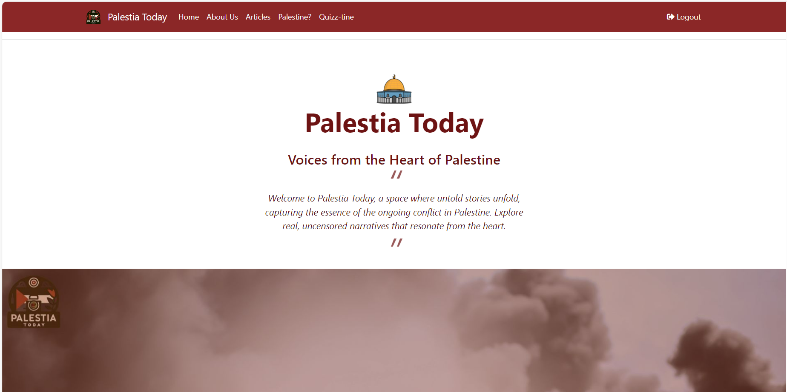
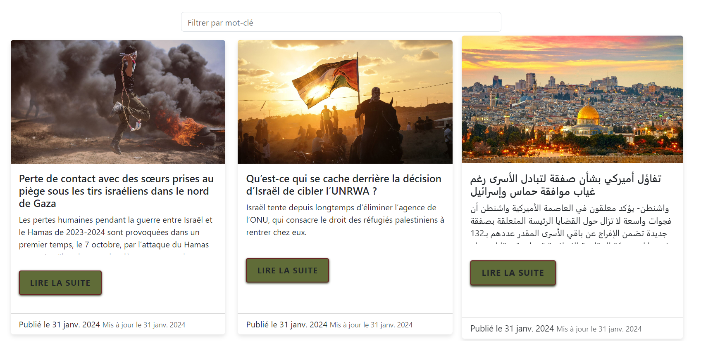

# Centralized News Portal: Palestia Blog

## Overview

Our project provides a centralized source of articles and news about the ongoing conflict in Palestine. It's designed to cater to a diverse range of users, including administrators, visitors, and subscribers, each with unique capabilities. The backend is crafted with Nest.js for robust performance, while the frontend is developed using Angular for an interactive and user-friendly experience.




### Key Stakeholders
- **Administrators:** Capable of adding and managing articles.
- **Visitors:** Can view articles.
- **Subscribers:** Engage with content through likes, comments, and ratings.

### Features
- **Article Management:** Add, edit, delete, and restore articles.
- **User Interaction:** Like, comment on, and rate articles.
- **Quiz Section:** Engage users with interactive quizzes.
- **Article Browsing:** Seamless viewing experience.
- **Admin Contact:** Easy access for feedback and queries.




## Getting Started

Follow these steps to set up and run the project on your local machine.

### Prerequisites
- Git
- Node.js
- npm (Node Package Manager)

### Installation

1. **Clone the repository**
   ```bash
   git clone https://your-repository-link.git
   cd your-project-directory
   cd nest_palestia
   npm install
   npm start
   cd angular
   npm install
   npm start
